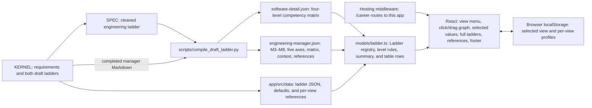
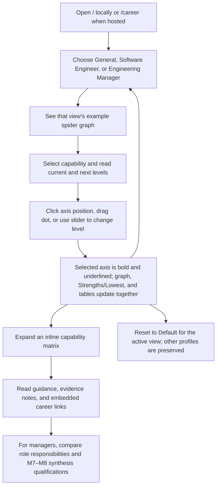

# Architecture

## System design

The immutable KERNEL defines the app's scope and supplies the engineering and management ladders. A cleaned engineering working copy repairs extraction errors; the completed manager draft is compiled directly. The compiler turns both into JSON. The app reads static JSON for each view, so it needs no backend or network request after loading.

The `Ladder` model contains titles, ordered levels, growth axes, per-axis expectations, defaults, references, optional competency details, and an optional saved-profile version. JSON supplies content and defaults; the registry attaches the software draft details. Every axis has an expectation at every level, satisfying `INV-001`: General has six axes and five levels, Software Engineer has five axes and six levels, and Engineering Manager has five axes and six levels. `getCapabilityRows` adds all-level labels and summaries to the available competency matrix and pads absent software cells with null, rendered as “—”. `LadderTable.tsx` renders this shared data in collapsed sections.

`LadderDetails` generalizes the former software-specific detail type. Optional introduction and supporting articles use paragraph, heading, list, and table blocks. `LadderContent.tsx` renders these with the existing MUI defaults and responsive cards, and converts inline Markdown links/emphasis into React elements. The original software guide, patterns, and parking lot remain supported. Manager role essentials, adjacent-role guidance, source contributions, and evidence notes remain separate from active expectations. M7–M8 synthesis notes are shown with selected levels and matrix headers.

The manager compiler merges M3–M6 and M7–M8 tables by matching competency names and validates all six populated cells across 34 rows. Graph expectations use each capability's first scope row verbatim. The five required manager references come from `KERNEL/requirements-v1.md`; the draft's additional sources remain embedded. `--check` fails on stale generated files, and `npm test` runs compiler tests and this freshness check before model tests.

`HomePage.tsx` controls the active profile and capability selection. Both graph and side slider send an explicit axis ID to the same update handler; normalization and summary logic stay in `models/`. `RadarChart.tsx` transforms browser pointer coordinates into SVG coordinates and captures the pointer for a drag. The model projects movement onto the chosen axis, rounds to a whole level, and clamps to the ladder's bounds. Release, cancellation, and loss of capture end the drag; changing views remounts the graph. The axis label selects without editing, and both the graph and side slider support keyboard level adjustment.

SVG controls suppress the browser's rectangular focus outline. Keyboard focus uses the dot stroke or label underline; clicking a dot does not draw a rectangle around its axis.

`App.tsx` owns routing, the view menu, and the default MUI light theme. `Footer.tsx` uses the referenced converter component's LinkedIn destination, adapting GitHub to this repository. The router accepts the root path for local development and an optional first `:app` segment for hosting at `/career`. Its navigation retains that segment. The former `/references` route redirects to the landing page within the same path prefix. General and Software Engineer retain their existing profile keys. The manager dataset sets `profileVersion: 3` because its previous five titles cannot be reliably mapped to M3–M8. It starts a fresh example while retaining the old v2 entry, and subsequently saves and restores v3 manager edits.

## User journey

The selected view and each view's profile are local to the browser. Switching views restores that view's last example. The graph is a reference for development conversations; its levels are not a promotion checklist.
