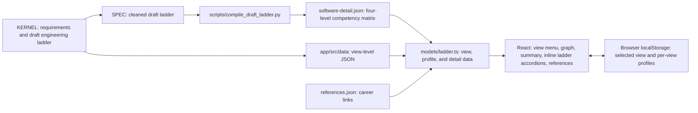
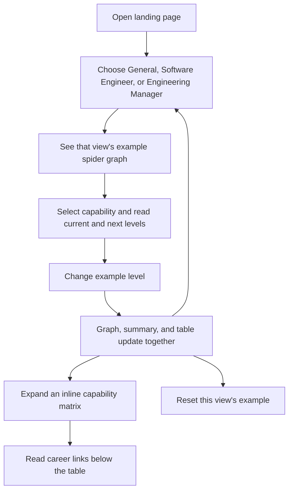

# Architecture

## System design

The immutable KERNEL defines the app's scope and supplies the draft engineering ladder. A cleaned Markdown working copy repairs extraction errors; a compiler turns its tables into JSON. The app reads static JSON for each view, so it needs no backend or network request after loading.

The graph and summary use the same model functions. Every axis has an expectation at every level, satisfying `INV-001`: General has six axes and five levels, Software Engineer has five axes and six levels, and Engineering Manager has three axes and five levels. The Software Engineer capability area embeds four-level competency tables from the cleaned draft, grouped into collapsed accordions. It shows the selected profile's summary even for Staff and Principal, which lie beyond that draft matrix. `App.tsx` owns routing, the view menu, and the default MUI light theme; views stay in `components/`. The former `/references` route redirects to the landing page.

## User journey

The selected view and each view's profile are local to the browser. Switching views restores that view's last example. The graph is a reference for development conversations; its levels are not a promotion checklist.
