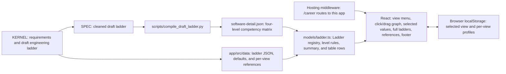
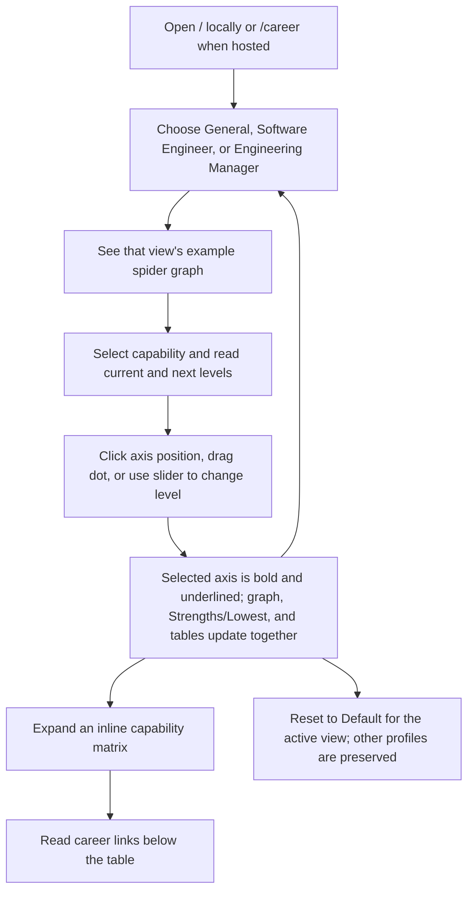

# Architecture

## System design

The immutable KERNEL defines the app's scope and supplies the draft engineering ladder. A cleaned Markdown working copy repairs extraction errors; a compiler turns its tables into JSON. The app reads static JSON for each view, so it needs no backend or network request after loading.

The `Ladder` model contains titles, ordered levels, growth axes, per-axis expectations, defaults, references, and optional competency details. JSON supplies all ladder content and defaults; the registry attaches the software draft details. Every axis has an expectation at every level, satisfying `INV-001`: General has six axes and five levels, Software Engineer has five axes and six levels, and Engineering Manager has three axes and five levels. `getCapabilityRows` adds all-level labels and summaries to the available competency matrix and pads missing detailed cells with null, rendered as “—”. `LadderTable.tsx` renders that shared data in collapsed sections for every view and preserves the software guide and parking lot.

`HomePage.tsx` controls the active profile and capability selection. Both graph and side slider send an explicit axis ID to the same update handler; normalization and summary logic stay in `models/`. `RadarChart.tsx` transforms browser pointer coordinates into SVG coordinates and captures the pointer for a drag. The model projects movement onto the chosen axis, rounds to a whole level, and clamps to the ladder's bounds. Release, cancellation, and loss of capture end the drag; changing views remounts the graph. The axis label selects without editing, and both the graph and side slider support keyboard level adjustment.

SVG controls suppress the browser's rectangular focus outline. Keyboard focus uses the dot stroke or label underline; clicking a dot does not draw a rectangle around its axis.

`App.tsx` owns routing, the view menu, and the default MUI light theme. `Footer.tsx` uses the referenced converter component's LinkedIn destination, adapting GitHub to this repository. The router accepts the root path for local development and an optional first `:app` segment for hosting at `/career`. Its navigation retains that segment. The former `/references` route redirects to the landing page within the same path prefix. The browser storage keys stay unchanged so existing profiles survive this milestone.

## User journey

The selected view and each view's profile are local to the browser. Switching views restores that view's last example. The graph is a reference for development conversations; its levels are not a promotion checklist.
